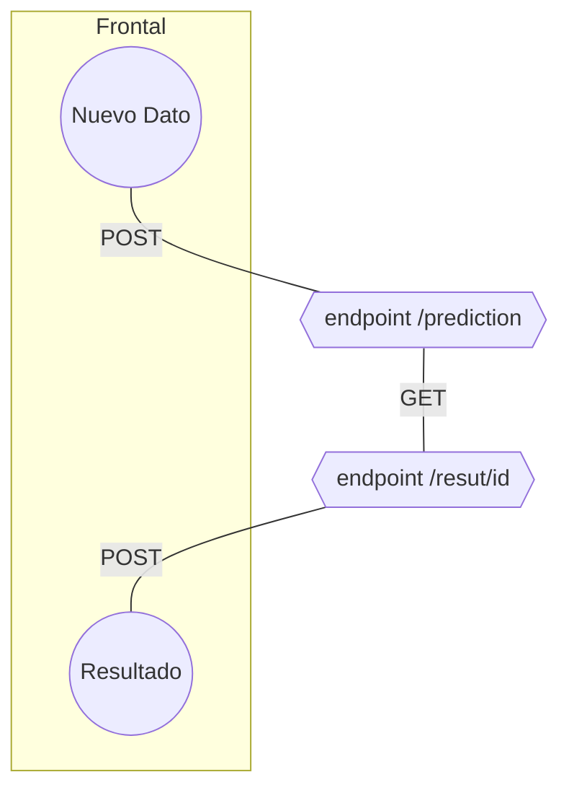
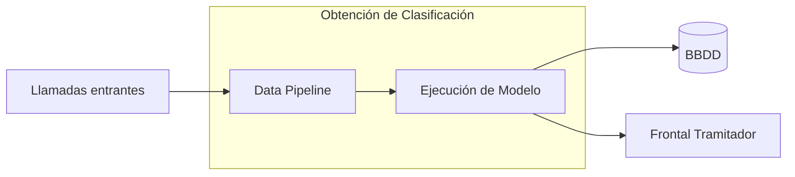

# modelollamadas

Modelo que clasifica el sentimiento de los textos transcritos de las llamdas entrantes en aperturas de siniestros.

# Alcance

Aplicación we que ejecuta un modelo en contenedor docker y AWS



## Aplicación




## Manual

__Docker__

El propósito de los contenedores es esta independencia: la capacidad de ejecutar varios procesos y aplicaciones por separado para hacer un mejor uso de su infraestructura y, al mismo tiempo, conservar la seguridad que tendría con sistemas separados.

Las herramientas del contenedor, como Docker, ofrecen un modelo de implementación basado en imágenes. Esto permite compartir una aplicación, o un conjunto de servicios, con todas sus dependencias en varios entornos. Docker también automatiza la implementación de la aplicación (o conjuntos combinados de procesos que constituyen una aplicación) en este entorno de contenedores.

[Información más detallada de Docker](https://www.redhat.com/es/topics/containers/what-is-docker)

__Pasos para el despliegue en Docker en local__

Después de realizar los archivos del proyecto, por ejemplo; modelo.pmml, requirements.txt, Dockerfile, app.py, se procede de la siguiente forma para construir y ejecutar la imagen Docker en local:

- Construir imagen Docker 

sudo docker build -t usuario/proyecto .

- Ejecutar imagen

sudo docker run -it --rm -p 5000:5000 usuario/proyecto (en este caso incluye el puerto porque es una aplicación web)

__Despliegue de servicio en remoto__

Para la puesta en producción de un modelo planteado como aplicación web es necesario transladar la imagen a un servidor o servicio web (GCP, AWS...) Esto permite automatizar los procesos y poder montarlos de forma independiente. Se adjunta ejemplo de cómo hacerlo en AWS:

-Servicio AWS EC2: Se crea instancia para desplegar la imagen.

  - Crear una key-pair y guardarla en local
  - Cambiar permisos al archivo de la clave a privado:
```bash
chmod 400 key-file-name.pem
```
  - Lanzar instancia. Escoger una Amazon Machine Instance (AMI) -> defecto (Amazon Linux 2 AMI (HVM), SSD Volume Type). Después, escoger hardware -> defecto (t2.micro). Pinchar en Review and launch
  - Se pasa a step7. En security groups añadir regla de HTTP para permitir acceso público a puerto 80
  - Una vez lanzada, tomar el nombre de la IPv4 DNS de la instancia y ejecutar:
```bash
ssh -i /path/my-key-pair.pem ec2-user@public-dns-name

ssh -i clave.pem ec2-user@ec2-34-244-199-232.eu-west-1.compute.amazonaws.com
```
  - Instalar Docker en instancia, a en el prompt de Amazon

```bash
sudo amazon-linux-extras install docker
sudo yum install docker
sudo service docker start
sudo usermod -a -G docker ec2-user
```
  - Copiar los archivos del proyecto en la instancia:
```bash
scp -i /path/my-key-pair.pem file-to-copy ec2-user@public-dns-name:/home/ec2-user

scp -i clave.pem archivo_a_copiar ec2-user@ec2-34-244-199-232.eu-west-1.compute.amazonaws.com:/home/ec2-user
```

Una vez copiados los archivos construir y ejecutar imagen desde terminal de instancia, igual que en local, pero aquí cambiar código y ejecución a puerto 80
